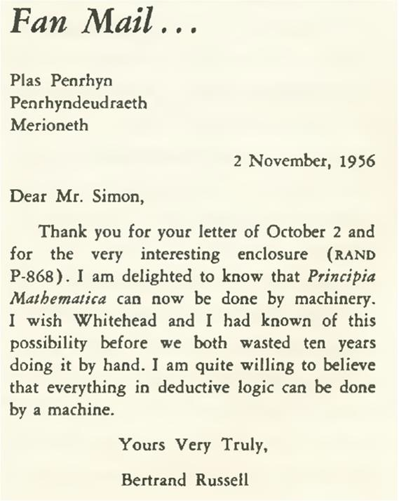
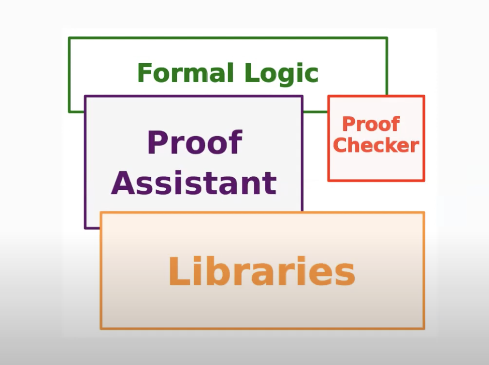

# La correspondencia de Curry-Howard

> Coloquio del Departamento de Matemáticas
> Universidad de Los Andes (Bogotá)
> 11/03/2024

Florent Schaffhauser
Universidad de Heidelberg

---
<!--
paginate: true
footer: Coloquio Uniandes 2024
header: Introducción
-->

## Matemáticas formales

- Formalizar las matemáticas no es una idea nueva.<!-- (think of Leibniz, Peano, Russell and Whitehead, Bourbaki, ... ). -->
- La noción de *computador* tampoco. <!-- (be it a person or a machine: think of Pascal, Euler, ... ).-->
- Lo relativamente novedoso es el hecho de *usar computadores para formalizar demostraciones*.

¿Será que el propósito de las matemáticas formales es comprobar que unos teoremas son correctos o hay algo más?

---

## Asistentes de prueba

- Formalizar matemáticas plantea una serie de retos y dificultades, tanto conceptuales como técnicos.
- También ofrece muchas oportunidades, en nuestra era numérica, por ejemplo [en docencia][HTPIWL].



---

## Pruebas formales y bibliotecas de matemáticas

- Hay que distinguir el desarrollo de asistentes de prueba de la formalización de resultados ya conocidos.
- Los asistentes de prueba pueden ayudarnos tanto a *comprobar* que nuestros enunciados son correctos como a *automatizar* algunas etapas de la prueba.
- El reto es saber si eso puede ayudarnos a hacer investigación en matemáticas y a transmitir conocimiento, posiblemente a gente que trabaje en otros temas.

---

## Plan de la charla

1. Matemáticas asistidas por computador
1. Introducción a la teoría de tipos
1. Una prueba formal en *Lean*

---
<!--
_header: ""
-->

## Matemáticas asistidas por computador

---
<!--
header: Matemáticas asistidas por computador
-->
## Fundamentos de las matemáticas

- En lógica clásica, se trabaja con el [Principio del tercero excluido][WikiPTE] (PTE), el cual nos permite hacer demostraciones por contraposición o contradicción.
- Las matemáticas usan las reglas de [deducción natural][WikiDeduccionNatural] y la **teoría de conjuntos** para representar conceptos matemáticos: un número, una función, una relación de equivalencia, *etc*, todos aquellos son *conjuntos*.
- El [axioma de elección][AE] (AE) también es de un uso común tanto en álgebra como en análisis.

---

## Matemáticas constructivas

- Se basan en la [lógica intuicionista][LogiIntu], sin el PTE ni el AE.
- Las reglas de deducción natural resultan ser equivalentes a las reglas del [$\lambda$-cálculo][LambdaCalc].
$$\frac{(\textcolor{red}{f :} P \to Q) \ \wedge \ (\textcolor{red}{x:}P)}{(\textcolor{red}{f(x) :} Q)}\,\small{\text{mp}}$$
- De acuerdo a eso, es buena idea reemplazar la teoría de conjuntos por la **teoría de tipos** para hablar de fundamentos de las matemáticas ("*todo es una función*").

---

## Matemáticas en la era de los computadores

- ¿Para qué y cómo utilizar computadores para hacer matemáticas?
- Primero que todo: para que *calculen* por nosotros. Luego, para que *comprueben* la correción de nuestras demostraciones.
- Un ejemplo famoso es el [Teorema de los cuatro colores][4colores] (debido a K. Appel y W. Haken, $1976$), que fue totalemente formalizado en el 2005 (por G. Gonthier, *utilizando únicamente el asistente de prueba Coq*).

<!--
- The proof of the 4-color theorem shows that the theorem holds except perhaps in a finite number of cases.
- Those $1834$ cases were then shown to be 4-colourable using various computer programs and algorithms, some of them written by J. Koch. Part of the proof was checked manually by Haken's daughter Dorothea Blohstein (born Haken).
-->

---

## Más allá de los cálculos

Hoy en día, los computadores son capaces de **representar** conceptos matemáticos en un *lenguaje formal*:

- Existen pruebas formales del [Teorema de los números primos][PNT] (en *Isabelle*).
- El [Teorema de Feit-Thompson][OddOrder], que dice que un grupo finito de orden impar es resoluble, ha sido [formalizado en Coq][MathComp.OddOrder].
- En el [*Liquid Tensor Experiment*][LTE], se formalizan teoremas de *matemáticas condensadas*, debidos a Clausen y Scholze.
<!-- - A recent example of the use of computers in mathematical research is provided by the [Liquid Tensor Experiment][LTE], which says that certain $Ext$ groups of the set of measures on a profinite set vanish.
- This is part of D. Clausen and  P. Scholze's approach to a general theory of analytic spaces, which is *currently being developed*.
-->

---

## Representación en un lenguaje formal

¿De qué se trata cuando formalizamos matemáticas?

- De definir objetos matemáticos, enunciar teoremas y escribir demostraciones completas de los mismos.
- De distinguir entre el aspecto mecánico (la compilación del programa) y el  conceptual (el escribir ese programa).
- De escribir un código claro y leíble. puede variar mucho, en el cual se puede confiar con un alto grado de certeza.

---

## Verificación y automatización

- En linguística, un lenguaje formal está compuesto de *términos* construidos a partir de un *alfabeto* y combinados siguiendo unas reglas que conforman su *gramática*.
- Un programa informático está escrito en un lenguaje formal.
- En un computador, uno puede implementar *rutinas* que ayuden a escribir pruebas y a calcular.

---

## Una breve historia de los asistentes de prueba

- Los pioneros fueron [Automath][Automath] (1967), Thm (1972), [LCF][LCF] (1972) y [Mizar] (1973).
- La siguiente generación se volvió capaz de manejar la [lógica de orden superior][LOS]: HOL, [Isabelle][Isabelle]  (1986), *etc*.
- Hoy en día, varios asistentes de prueba utilizan la [teoría de los tipos dependientes][DTT]: [Coq][Coq] (1989), [Agda][Agda] (1999), [Lean][Lean] (2013), *etc*.

---

## Estructura de un asistente de prueba



- La estructura básica de un asistente de prueba siempre es la misma.
- El verificador de prueba es tan sólo una parte (el compilador).
- El humano interactua con el asistente para escribir bibliotecas.

*Image credits:* [Assia Mahboubi][Assia].

---
<!--
_header: ""
-->

## Introducción a la teoría de tipos

---
<!-- 
header: Introducción a la teoría de tipos
-->

## Matemáticas "bien tipadas"

*Afirmación:* Es posible construir gran parte de las matemáticas modernas basándose en la [teoría intuicionista de tipos][ITT], que se debe a Per Martin-Löf (1972).

Los tres conceptos mayores son:

- Tipos inductivos.
- Proposiciones-como-tipos (la [correspondencia de Curry-Howard][CurryHoward]).
- Universos y [funciones dependientes][DTT] (`Π`-tipos).

La implementación informática está basada en el [Cálculo de Construcciones][CC] (Thierry Coquand, 1980s). Para ir más lejos, se pueden incorporar conceptos de [Teoría Homotópica de Tipos][HoTT].

---

## Tipos y términos

- Un *tipo* es una colección de datos, llamados *términos*, que obedecen unas reglas precisas de *introducción* y *eliminación*. Definir un tipo consiste en especificar esas reglas, siguiendo un formalismo preciso.
- Por ejemplo, la gran mayoría de los lenguajes de programación contienen una implementación del tipo de los números naturales, denotado por `Nat` o `ℕ` y cuyos términos son `0, 1, 2, ...`. Como veremos, esto es un ejemplo de **tipo inductivo**.
- A continuación, daremos ejemplos explícitos, utilizando la sintaxis del lenguaje de programación [Lean][Lean], creado por Leonardo de Moura en el 2013.

---

## Funciones

Si `X` y `Y` son tipos, podemos conformar el tipo `X → Y`, cuyos términos son las funciones de `X` a `Y`, los cuales se definen así:

```haskell
#check (ℕ → ℕ)                       -- ℕ → ℕ : Type

def f := fun (n : ℕ) => 2 * n

#check f                             -- f (n : ℕ) : ℕ
#check @f                            -- f : ℕ → ℕ
```

Además, algunos cálculos básicos pueden llevarse a cabo directamente en el compilador:

```haskell
#reduce f 21                         -- 42
```

---

## Tipos inductivos

La implementación de los enteros naturales como tipo inductivo utiliza los [axiomas de Peano][Peano].

```haskell
inductive Nat
| cero : Nat
| suc : Nat → Nat
```

Es decir que `cero` es un término de tipo `Nat` y que, para todo término `n` de tipo `Nat`, tenemos un término `succ n`.

Esa declaración define funciones `Nat.cero` y `Nat.suc`, llamadas *constructores*.

```haskell
#check Nat.cero                     -- Nat.zero : Nat
#check @Nat.suc                     -- Nat.suc : Nat → Nat
```

---

## El tipo producto

Si `X` y `Y` son tipos, podemos conformar un tipo `X × Y`, cuyos términos se construyen a partir de un término `x : X` y un término `y : Y`.

```haskell
inductive Prod (X Y : Type)
| intro (x : X) (y : Y)
```

En este caso, hay un solo constructor, `Prod.intro`, el cual nos dice cómo *introducir* términos de tipo `X × Y`.

```haskell
#check Prod.intro
-- Prod.intro (x : X) (y : Y) : Prod X Y
```

Se puede también utilizar la notación `(x, y)` para el término `Prod.intro (x : X) (y : Y)`.

---

## Proyecciones

Ahora, para *eliminar* términos de un tipo inductivo como `X × Y`, se utiliza el método de búsqueda de patrones (*pattern matching*).

```haskell
def pr₁ : X × Y → X :=
fun (t : X × Y) => match t with
| Prod.intro x y => x

#check @pr₁                     -- pr₁ : X × Y → X
````

Para un tipo inductivo con varios constructores, se hace *pattern matching* sobre cada constructor.
<!--
---

## Principio de inducción

Al ser declarado el tipo `Nat` como un tipo inductivo, el compilador genera *automáticamente* un principio de inducción. Ahí vemos aparecer por primera vez el tipo `Prop`.

```haskell
#check Nat.rec
  -- Nat.rec {P : ℕ → Prop} 
  -- (cero : P 0)
  -- (suc : ∀ (n : ℕ), P n → P (n + 1)) : 
  -- ∀ (t : ℕ), P t
```

In the code above, `Nat.rec` is seen as a function that, in the presence of a *predicate* `P : ℕ → Prop`, sends a proof of `P 0` and a proof of the fact that, for all `n : ℕ`, `P n` implies `P (n + 1)`, to a proof of `P t` for all `t : ℕ`.
-->
---

## Conjunciones

Volviendo a la analogía entre el $\lambda$-cálculo y la deducción natural, podemos *representar proposiciones por tipos*:

- Supongamos que `P` y `Q` son proposiciones ya definidas. Entonces cómo definir la proposición `P ∧ Q`?
- Si pensamos en `P` y `Q` como tipos, entonces la proposición `P ∧ Q` es simplemente el tipo producto de `P`y `Q`definido anteriormente!
- En el sentido que una demostración de `P ∧ Q` es, por definición, un par `(p, q)` donde `p` es una demostración de `P` y `q` es una demostración de `Q`.

---

## Implicaciones

- Supongamos que `P`y `Q` son proposiciones ya definidas. Entonces qué significa decir que `P` implica `Q`?
- Si pensamos en `P` y `Q` como tipos, entonces la proposición `P → Q` es el tipo de funciones de `P` a `Q` y pensamos en tal función como una *demostración* de la proposición `P → Q`.
- Por ejemplo, la primera proyección `pr₁ : P × Q → P` que definimos anteriormente ahora se interpreta como una demostración de la proposición `P ∧ Q → P`. En particular, tal implicación es una tautología.

---

## Funciones dependientes

- Si `P x` es una familia de proposiciones parametrizada por un término `x: X`, qué significa decir que `∀ x, P x`? Por ejemplo, `∀ x : ℝ, x ^ 2 ≥ 0`.
- Primero, caigamos en cuenta de que, para todo `x` de tipo `X`, el término `P x` es una proposición, es decir un tipo que *depende* de x.
- Segundo, lo que estamos tratando de construir es una función que envía `x : X` a una demostración de `P x`, es decir una función cuyo tipo de retorno depende del término de entrada.

---

## El cuantificador universal

- Pensamos en la familia de proposiciones `P x` como una familia de tipos.
- Entonces, demostrar *la* proposición `∀ x, P x` significa, por definición, construir una función dependiente
`f : (x : X) → P x`.
- En ese formalismo, la familia `P` se ve como una función
`P : X → Type`, donde `Type` es el *universo* de los tipos y `(x : X) → P x` es el `Π`-tipo (Pi-tipo) asociado a `P`.

---

## Pares dependientes

<!--En teoría homotópica de tipos, se ve a una familia `P : X → Type` como una fibración sobre `X` y a `f : (x : X) → P x` como una sección de esa fibración. Más precisamente, se contruye un tipo inductivo `Fib X P`, llamado `Σ`-tipo, cuyos términos son los pares `(x, y)` donde `x: X` y `y : P x`.-->

Podemos asociarle a la familia `P : X → Type` un tipo inductivo llamdo `Σ`-tipo, cuyos términos son los pares `(x, y)` donde `x: X` y `y : P x`.

```haskell
inductive Σ (X : Type) (P : X → Type)
| intro (x : X) (y : P x)
````

Si `P : X → Type` es constante, entonces volvemos a encontrar el producto `X × Y`. Nótese que un término de tipo `Σ X P` es de la forma `Σ.intro x y` donde `y : P x`. Tal término se interpreta como una demostración de la proposición `∃ x, P x`.

<!--
Our term `MyFirstProof` is recognised as a *dependent function*: it sends a natural number `n` to a proof of a statement *that depends on* `n`.

```haskell
#check @MyFirstProof  -- MyFirstProof : ∀ (n : ℕ), ∃ k, 4 * n = 2 * k

#check MyFirstProof   -- MyFirstProof (n : ℕ) : ∃ k, 4 * n = 2 * k
```

The term `MyFirstProof 2` is recognised as a proof of the proposition `∃ k, 4 * 2 = 2 * k` and we can use it as such.

```haskell
#check MyFirstProof 2  -- MyFirstProof 2 : ∃ k, 4 * 2 = 2 * k

def EightIsEven : ∃ m : ℕ, 8 = 2 * m := MyFirstProof 2
```
-->
---

## Más tipos dependientes

Dado tipos `X` y `Y`, podemos construir un tipo inductivo llamado suma (o coproducto) de `X` y `Y`.

```haskell
inductive Sum (X Y : Type)
| from_left (x : X)
| from_right (y : Y)

#check @Sum.from_left   -- @Sum.from_left : X → Sum X Y
#check @Sum.from_right  -- @Sum.from_right : Y → Sum X Y
```

La interpretación en términos de proposiciones es la disyunción `P ∨ Q`. Y la implicación `P → P ∨ Q` es una tautología, porque tenemos la función `Sum.from_left : P → P ∨ Q`.

---
<!-- 
_header: ""
-->

## Una prueba formal en *Lean*

---
<!-- 
header: "Una prueba formal en Lean"
-->

## Un ejemplo

Consideremos el siguiente enunciado:

> **Teorema.** Sean `n` y `m`dos enteros naturales. Supongamos que `n` es par o que `m` es par. Entonces `n * m` es par.

Una formalización de esto podría parecerse a [algo así](#utilizando-la-biblioteca-mathlib-de-lean):

```haskell
∀ (n m : Nat), n.isEven ∨ m.isEven → (n * m).isEven
```

Es decir que tenemos que definir:

- Una proposición `n.isEven` (parametrizada por `n : Nat`).
- Una función `n.isEven ∨ m.isEven → (n * m).isEven` (parametrizada por `(n m : Nat)`).

---

## El tipo de los enteros pares

Decir que `n : Nat` es par significa `∃ k : Nat, n = 2 * k`. Esto se formaliza mediante:

- Un entero `k : Nat`.
- Una prueba de que `n = 2 * k`, es decir **un término** `p` **de tipo** `n = 2 * k`.

La definición formal puede ser la siguiente

```haskell
inductive Nat.isEven (n : Nat)
| intro (k : Nat) (p : n = 2 * k)
```

Es decir que podemos pensar en un término `t : Nat.isEven n` como un *par dependiente* `(k,p)`, donde `p : n = 2 * k`.

---

## El tipo `n.isEven`

Tenemos tipos bien definidos pero que no necesariamente tienen términos: un tipo puede *tener habitantes* o no.

```haskell
#check isEven 2               -- Nat.isEven 2 : Type
#check isEven 3               -- Nat.isEven 3 : Type
```

Gracias a la manera como definimos el tipo `isEven`, también tenemos acceso a la siguiente notación:

```haskell
variable (m : Nat)
#check m.isEven                -- Nat.isEven m : Type 
#check (2 : Nat).isEven        -- Nat.isEven 2 : Type 
```

---

## Introducción de términos

Podemos mostrar que el tipo `isEven 2` tiene habitantes:

```haskell
def two_is_even : Nat.isEven 2 := Nat.isEven.intro 1 rfl
```

Es decir que `two_is_even` es el par dependiente `(1, rfl)` donde `rfl : 2 = 2 * 1`. Más precisamente, la prueba `rfl` de que `2 = 2 * 1` es el término `Eq.refl 2`, el cual dice que `2 ≡ 2 * 1` en el compilador (por definición de `*` en `Nat`).

De igual manera, los múltiplos de `2` son pares:

```haskell
def mult_of_2_is_even (m : Nat) : (2 * m).isEven := 
  Nat.isEven.intro m rfl
```

---

## Lema 1 : `n.isEven → (n * m).isEven`

La demostración matemática es la siguiente:

> Si `n` es par, entonces existe `k` tal que `n = 2 * k`, luego
`n * m = (2 * k) * m = 2 * (k * m)` y eso demuestra que `n * m` es par.

Y la prueba formal es la siguiente:

```haskell
def Lema1 : (n m : Nat) → n.isEven → (n * m).isEven :=
fun n m (Nat.isEven.intro  (k : Nat) (p : n = 2 * k)) =>
  let q : (n * m) = 2 * (k * m) :=          -- definición local
    Eq.trans (congrArg (fun x => x * m) p) (Nat.mul_assoc 2 k m)
  Nat.isEven.intro (k * m) q
```

Es decir que una prueba formal es un **programa**.

---

## Lema 2 : `m.isEven → (n * m).isEven`

Queremos formalizar el siguiente argumento:

> Si `m = 2 * k`, entonces `n * m = n * (2 * k) = (n * 2) * k = (2 * n) * k = 2 * (n * k)`.

Podemos incorporar el cálculo en el programa, justificando cada paso:

```haskell
def Lema2 : (n m : Nat) → m.isEven → (n * m).isEven :=
fun n m (Nat.isEven.intro (k : Nat) (p : m = 2 * k) =>
  let (q : n * m = 2 * (n * k)) :=
    calc
      n * m = n * (2 * k) := congrArg (fun x => n * x) p 
      _     = (n * 2) * k := Eq.symm (Nat.mul_assoc n 2 k)
      _     = (2 * n) * k := congrArg (fun x => x * k) (Eq.symm (Nat.mul_comm 2 n))
      _     = 2 * (n * k) := Nat.mul_assoc 2 n k 
  Nat.isEven.intro (n * k) q
```

---

## Demostración del teorema

Ya con eso podemos demostrar que

```haskell
n.isEven ∨ m.isEven → (n * m).isEven
```

La demostración se hace por *pattern matching* en los términos de tipo `n.isEven ∨ m.isEven` y utiliza las *funciones* `Lema1` y `Lema2`.

```haskell
def Teorema : (n m : Nat) → n.isEven ∨ m.isEven → (n * m).isEven :=
fun n m t => match t with
| ∨.from_left (t : n.isEven) => Lema1 n m t
| ∨.from_right (t : m.isEven) => Lema2 n m t
```

---

## Demostración asistida por computador

- ¿Por qué le decimos *asistente de prueba* a un lenguaje de programación como Lean? Porque nos puede colaborar para la escritura de un programa como la prueba del teorema anterior.
- En Lean, esa colaboración se lleva a cabo a través de un **modo táctico** (lo que hemos visto por ahora es el modo término).
- Como ejemplo, veamos una demostración, utilizando tácticas de *Mathlib*, del teorema que formalizamos hoy: [Enlace1][Coloquio2024live] y [Enlace2][Coloquio2024hhu].

---

## Utilizando la biblioteca Mathlib de Lean

Demostración de [nuestro teorema](#un-ejemplo) con el [modo táctico][Coloquio2024live] de Lean:

```haskell
import Mathlib.Tactic.Cases
import Mathlib.Tactic.Use

def Nat.isEven (n : Nat) : Prop := ∃ k : Nat, n = 2 * k

theorem Coloquio2024 : ∀ (n m : Nat),
  n.isEven ∨ m.isEven → (n * m).isEven 
    := by {
      intro n m t
      cases' t with h1 h2
      · cases' h1 with k1 p1
        unfold Nat.isEven 
        use (k1 * m)
        rw [p1, Nat.mul_assoc]
      · cases' h2 with k2 p2
        unfold Nat.isEven
        use (n * k2)
        rw [p2, ← Nat.mul_assoc, Nat.mul_comm n 2, Nat.mul_assoc]
    }
```

[HTPIWL]: https://djvelleman.github.io/HTPIwL/
[4colores]: https://es.wikipedia.org/wiki/Teorema_de_los_cuatro_colores
[PNT]: https://es.wikipedia.org/wiki/Teorema_de_los_números_primos
[OddOrder]: https://en.wikipedia.org/wiki/Feit–Thompson_theorem
[MathComp.OddOrder]: https://github.com/math-comp/odd-order
[LTE]: https://leanprover-community.github.io/blog/posts/lte-final/
[Assia]: http://people.rennes.inria.fr/Assia.Mahboubi/
[CC]: https://en.wikipedia.org/wiki/Calculus_of_constructions
[HoTT]: https://homotopytypetheory.org/book/
[Lean]: https://en.wikipedia.org/wiki/Lean_(proof_assistant)
[Peano]: https://es.wikipedia.org/wiki/Axiomas_de_Peano
[CurryHoward]: https://en.wikipedia.org/wiki/Curry–Howard_correspondence
[LCF]: https://en.wikipedia.org/wiki/Logic_for_Computable_Functions
[DTT]: https://en.wikipedia.org/wiki/Dependent_type
[Mizar]: https://en.wikipedia.org/wiki/Mizar_system
[WikiDeduccionNatural]: https://es.wikipedia.org/wiki/Deducción_natural
[WikiPTE]: https://es.wikipedia.org/wiki/Principio_del_tercero_excluido
[AE]: https://es.wikipedia.org/wiki/Axioma_de_elección
[LogiIntu]: https://es.wikipedia.org/wiki/Lógica_intuicionista
[LambdaCalc]: https://es.wikipedia.org/wiki/Cálculo_lambda
[LOS]: https://es.wikipedia.org/wiki/Lógica_de_orden_superior
[ITT]: https://en.wikipedia.org/wiki/Intuitionistic_type_theory
[Coloquio2024live]: https://live.lean-lang.org/#url=https%3A%2F%2Fmatematiflo.github.io%2FFormalMath%2FLosAndes2024.lean
[Coloquio2024hhu]: https://lean.math.hhu.de/#url=https%3A%2F%2Fmatematiflo.github.io%2FFormalMath%2FLosAndes2024.lean
[Automath]: https://en.wikipedia.org/wiki/Automath
[Isabelle]: https://en.wikipedia.org/wiki/Isabelle_(proof_assistant)
[Coq]: https://en.wikipedia.org/wiki/Coq_(software)
[Agda]: https://en.wikipedia.org/wiki/Agda_(programming_language)
