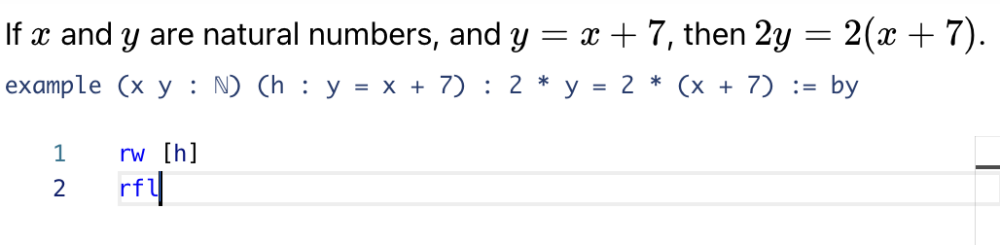

# An informal introduction to formal mathematics

> 早稲田大学
> 2023/11/29

Florent Schaffhauser
Heidelberg University

---

<!--paginate: true -->
<!-- footer: Waseda University, Geometry Seminar -->
<!--
_backgroundColor: cyan
_color: black
-->
## Goal: introductory talk on Proof Assistants and Formal Mathematics




---
<!--
_backgroundColor: cyan
_color: black
-->
## Introduction (2 mins)

- Briefly introduce yourself and set the stage for the talk.
- Pose a concise thought-provoking question related to formal mathematics.

---

## Formalised mathematics

- Formalisation of mathematics is not a new idea: Leibniz, Frege, ...
- Neither is the notion of a *computer* (person or machine).
- What is relatively recent is the *use of computers to formalise proofs* (1960s onward).
- The formalisation of mathematics poses a number of challenges and difficulties.
- It also offers a lot of opportunities in a digital age (e.g. in teaching).

What is the current state of affairs and what can we hope to achieve?

---

## From Leibniz to the *Principiae Mathematicae*

-

---

## Formal proofs

- Two aspects: correctness checking and automation.
-

---
<!--
_backgroundColor: cyan
_color: black
-->
## Historical context and recent advances (15 mins)

- Provide a swift overview of the historical development of proof assistants.
- Connect historical milestones to the challenges faced by mathematicians.
- Discuss key recent advancements in proof assistants and their impact on contemporary mathematics.

---
<!--
_backgroundColor: cyan
_color: black
-->
## A primer on type theory for mathematicians (15 mins)

- An introduction to type-theoretic mathematics.

---

## Type-theoretic mathematics

*Claim:* It is possible to build a large amount of modern mathematics using type-theoretic foundations. 

The general framework is provided by the [Calculus Of Constructions](https://en.wikipedia.org/wiki/Calculus_of_constructions), as well as the following three concepts from type theory:

- Inductive types.
- The `Prop` type.
- The type of dependent functions (a.k.a. `Pi` types).

To go further, one can also incorporate concepts from [Homotopy type theory](https://homotopytypetheory.org/book/) (`HoTT`).

But first, *what is a type*?

---

## Types and terms

A *type* is specified by its *terms*. For instance, most programming languages contain an implementation of the type of natural numbers `ℕ`, whose terms are `0, 1, 2, ...`.

```haskell
#check ℕ                              -- ℕ : Type

def n0 := (42 : ℕ)

#check n0                             -- n0 : ℕ

#eval n0                              -- 42
```

The example above uses the syntax of the **Lean programming language**, created by Leanardo De Moura in 2013. Basic computations are natively supported in Lean.

```haskell
#eval 2 * n0                          -- 84
```

---

## Functions between types

If `X` and `Y` are types, there is a type `X → Y`. Its terms are the functions from `X` to `Y`.

```haskell
#check (ℕ → ℕ)                       -- ℕ → ℕ : Type

def f := fun (n : ℕ) => 2 * n

#check @f                            -- f : ℕ → ℕ
```

`def f := λ (n : ℕ), 2 * n` would also be recognised by the compiler.

```haskell
#check f                             -- f (n : ℕ) : ℕ
```

Functions can be evaluated on terms. The syntax `#eval f(n0)` would not compile.

```haskell
#eval f n0                           -- 84
```

---

## Inductive types
<!--
_backgroundColor: cyan
-->
For instance, the type of natural numbers `ℕ`.

```haskell
inductive ℕ :=
| 0 : ℕ
| succ (n : ℕ) : ℕ
```

> **SAY MORE ON THIS** (with `#check ℕ.succ`, `#check @ℕ.succ` *etc*). Then mention Lists and proofs by induction (or even just pattern matching and cases by case check).

---

## The `Prop` type

`Prop` is the type whose terms are the formulas from [first-order logic][FOL].

One starts from a language, with basic symbols such as `+` or `` , and defines formulas inductively, following a set of rules. Terms of type `Prop` are defined by such formulas.

```haskell
def Example1 := ∀ n : ℕ, ∃ k : ℕ, 4 * n = 2 * k

#check Example1                       -- Example1 : Prop
```

This is a well-defined mathematical statement, but we have not proved it yet.

---

## Propositions as types

Mathematically erroneous statements will type-check if they are syntactically correct.

```haskell
def Example2 := ∀ n : ℕ, ∃ k : ℕ, 4 * n = 2 * k + 1

#check Example2                       -- Example2 : Prop
```

To start doing mathematics, the idea is

> to *view propositions as types*, whose terms are *proofs of that proposition*.

In proof theory, this is known as the [**Curry-Howard correspondence**](https://en.wikipedia.org/wiki/Curry–Howard_correspondence).

```haskell
def MyFirstProof : ∀ n : ℕ, ∃ k : ℕ, 4 * n = 2 * k := sorry
```

Here, `MyFirstProof` is a term of type `∀ n : ℕ, ∃ k : ℕ, 4 * n = 2 * k`.

---

## Multiples of `4` are divisible by `2`

For the proof of a proposition, such as `∀ n : ℕ, ∃ k : ℕ, 4 * n = 2 * k`, one works backwards, reducing the goal to an already proved statement.

```haskell
def MyFirstProof : ∀ n : ℕ, ∃ k : ℕ, 4 * n = 2 * k := by
  intro n      -- we introduce a natural number `n` in our local context
  use (2 * n)  -- we claim that we can use `k = 2 * n` to "solve the goal"
  ring         -- we finish the proof by computation
```

Evolution of the *tactic state*:

```lean
∀ n : ℕ, ∃ k : ℕ, 4 * n = 2 * k  -- goal at the beginning
∃ k : ℕ, 4 * n = 2 * k           -- after intro n
4 * n = 2 * (2 * n)              -- after use (2 * n)
4 * n = (2 * 2) * n              -- associativity of multiplication
No goals                         -- definitionally equal terms
```

---

## The type of dependent functions

What we wrote before is in fact a function that sends a natural number `n` to a proof of a statement *that depends on* `n`.

```haskell
#check @MyFirstProof  -- MyFirstProof : ∀ (n : ℕ), ∃ k, 4 * n = 2 * k

#check MyFirstProof   -- MyFirstProof (n : ℕ) : ∃ k, 4 * n = 2 * k
```

Our type `MyFirstProof` is recognised as a *dependent function*. The term `MyFirstProof 2` is recognised as a proof of the proposition `∃ k, 4 * 2 = 2 * k` and we can use it as such.

```haskell
#check MyFirstProof 2  -- MyFirstProof 2 : ∃ k, 4 * 2 = 2 * k

def EightIsEven : ∃ m : ℕ, 8 = 2 * m := MyFirstProof 2
```

---
<!--
_backgroundColor: cyan
_color: black
-->
## Motivation, Purpose, and Engaging Examples (20 mins)

- Share your personal motivation for working in this field.
- Clearly articulate the purposes and benefits of proof assistants in modern mathematics.
- Present interactive examples or mini-problems related to formal mathematics, inviting audience participation.

---
<!--
_backgroundColor: cyan
_color: black
-->
## Challenges and Limitations (5 mins)

- Address the intrinsic difficulties and limitations in the field.
- Acknowledge ongoing challenges and areas for improvement.

---
<!--
_backgroundColor: cyan
_color: black
-->
## Reflection and Closing Discussion (3 mins)

- Summarize key points and insights from the talk.
- Open the floor for a brief discussion or reflections from the audience.

---


[FOL]: https://en.wikipedia.org/wiki/First-order_logic